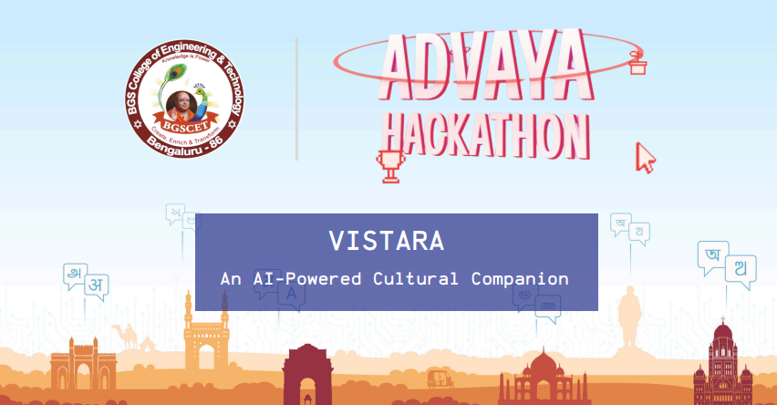

# COSMIC x Advaya

## Team Details

- **Team Number:** 85
- **Team Name:** COSMIC
- **Team Leader:** Kishore S R
- **Email:** kishoresr01@gmail.com
- **Phone:** 9900568584
- **Team Members:**
  - Harshavardhan M
  - Hitesh P
  - Jeevan N

> **Theme:** Boosting Culture and Tourism through Tech

> #### **Problem Statement:** Tourists struggle to find authentic cultural experiences and contribute to heritage economies.

 &nbsp;

## About Our Project

UTKARSH is not just a platform — it’s a movement to reshape the future of cultural tourism in India and beyond.  
It is designed to bridge the gap between curious travellers and the forgotten roots of heritage, using modern tech, community voices, and real-world impact.

## Tech Stack

           

## Key Features

- 🏛️ **Explore Heritage Sites**: Stories, photos & food highlights in your language.
- 📸 **Upload Travel Stories**: Share images or videos of your journeys.
- 🛍️ **Discover Local Crafts**: Buy handmade items directly from artisans.
- 🤝 **Find Travelers Like You**: Meet people visiting the same place and time.
- 🎖️ **Earn Travel Rewards**: Get badges, discounts for conscious tourism.
- 📍 **Geolocation Alerts**: Get nearby event & heritage site notifications.

## Team Cosmic

   
